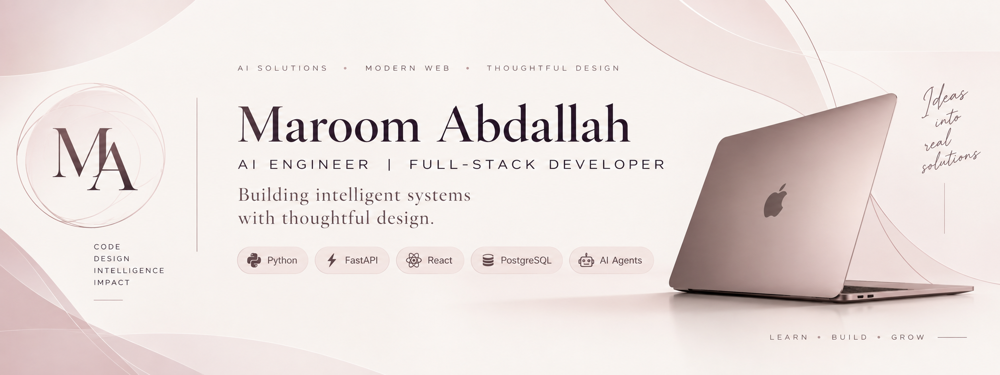

 

  

# Maroom Abdallah

### AI Engineer | Full-Stack Developer

*Building intelligent systems with thoughtful design.*

---

### About Me

I'm an AI Engineer and Full-Stack Developer passionate about building intelligent applications, scalable backend systems, and AI agents.

Currently exploring AI Agent Design, RAG, and MCP.

---

### Tech Stack

**Languages:** Python · Java · TypeScript · JavaScript

**Backend:** FastAPI · Spring Boot · PostgreSQL · MySQL

**Frontend:** React · HTML · CSS

**AI:** AI Agents · RAG · MCP · Multi-Agent Systems

**Tools:** Docker · Git · GitHub · Postman

---

### Featured Projects

| Project | Description |
|:---:|:---|
| [Mini ERP](https://github.com/maroomabdallah-ux/mini-erp-backend) | Full-stack ERP with an AI-powered assistant |
| [Shopping Cart](https://github.com/maroomabdallah-ux/Shopping-cart-Backend) | Full-stack e-commerce application |
| [Portfolio](https://maroomabdallah-ux.github.io/) | My personal portfolio |

---

### Let's Connect

[GitHub](https://github.com/maroomabdallah-ux) · [Portfolio](https://maroomabdallah-ux.github.io/)

